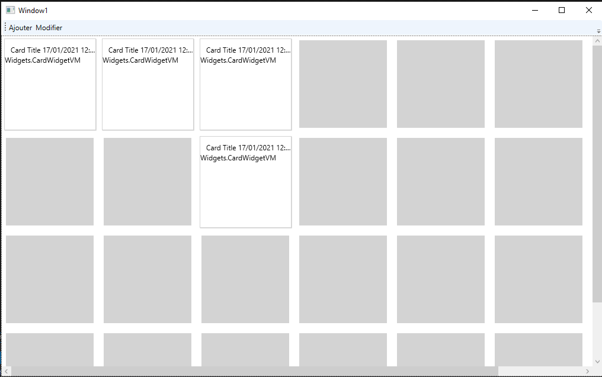

# OptimIT.Dashboard

Following the amazing work of [@DustinBryant](https://github.com/DustinBryant/WpfDashboardControl/commits?author=DustinBryant) in 
[DustinBryant/WpfDashboardControl](https://github.com/DustinBryant/WpfDashboardControl) A nuget package is really needed, also for adding more features, because the given example in the original repository is following MVVM and hardly coupled with the demo. so I wanted to separate things a little bit. Enjoy !!!

# NUGET

`Install-Package OptimIT.Dashboard`

# OptimIT
We are a software developement company in Algeria, we create amazing software, checkout our website [optimit.dz](https://optimit.dz) or contact us at [info@optimit.dz](info@optimit.dz).

# Screenshots

A Simple window:
 
